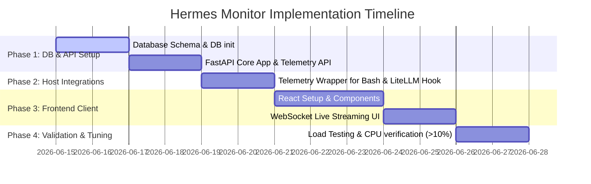

# Hermes Agent Monitoring & Dashboard System

The goal of this project is to build a robust monitoring dashboard to display and manage the behavior, tasks, resource usage, and API key health of the **Hermes Agent** ecosystem. This system is designed specifically to support 24/7 autonomous operations running on an Oracle Cloud Free Tier instance, utilizing local Ollama instances (for supervisors) and LiteLLM proxying (with key-rotation for workers) across SWE and YouTube domains.

```mermaid
graph TD
    subgraph Host ["Oracle ARM Server (Ubuntu)"]
        CL[company_loop.sh] -->|Spawns| SL[SWE Supervisor (Ollama/Gemma)]
        CL -->|Spawns| YL[YT Supervisor (Ollama/Gemma)]
        
        SL -->|Spawns| SWA[SWE Sub-Agents]
        YL -->|Spawns| YTA[YT Sub-Agents]
        
        SWA & YTA -->|Queries/API Calls| LLM[LiteLLM Proxy :4000]
        LLM -->|Rotates Keys & Proxies| ExtAPI[External APIs: Gemini/OpenCode/OpenRouter]
        
        AgentLogs[Agent Logs & ~/.hermes/hermes_state.db]
    end

    subgraph MonitoringStack ["Hermes Dashboard Stack"]
        DB[(PostgreSQL)]
        API[FastAPI Backend]
        UI[React Frontend]
        
        API -->|Read/Write| DB
        API -->|Monitors / Polls logs| AgentLogs
        CL & SL & YL & LLM -->|Telemetry webhooks/Logs| API
        UI <-->|WebSocket / REST API| API
    end
```

---

## User Review Required

> [!IMPORTANT]
> **Host Telemetry and Agent Communication Channel**: We need a lightweight mechanism for existing shell scripts (`company_loop.sh`) and python sub-agents to report execution progress to the monitoring database. We propose exposing simple telemetry endpoints `/api/v1/telemetry/heartbeat` and `/api/v1/telemetry/log` in the FastAPI backend, which scripts can hit using `curl` or python `requests`.
>
> **LiteLLM Integration**: Since LiteLLM proxy manages the key rotation, we can parse LiteLLM's logging webhooks to automatically track key usage, token counts, costs, and rate limit errors in PostgreSQL. This avoids modifying the agent's code directly.

---

## Open Questions

> [!IMPORTANT]
> 1. **Ollama & Local Resource Isolation**: Gemma 9B on Oracle ARM (using CPU/ARM Neoverse cores) will run relatively slowly. Do we want the dashboard to display the Ollama generation queue and execution latency separately?
> 2. **Authentication & Security**: Since this runs on Oracle Free Tier, will this dashboard be exposed to the public internet? If so, should we add basic auth (JWT/OAuth) to secure the monitoring UI?
> 3. **Interactive Control**: Do you want the ability to pause/stop `company_loop.sh` or trigger tasks directly from the React UI, or should the dashboard be purely read-only monitoring?

---

## Proposed Changes

We will create a structured project inside the repository containing:
1. `backend/`: Python FastAPI app, SQLAlchemy/SQLModel models, migrations, and WebSocket logger.
2. `frontend/`: React + Vite client using vanilla CSS for premium UI styling and ChartJS/Recharts for metrics.
3. `agent_integrations/`: Integration hooks for `company_loop.sh` and custom LiteLLM configuration.

---

### Database Schema (PostgreSQL)

#### [NEW] [schema.sql](file:///d:/GitRepo/hermes_agent/backend/app/db/schema.sql)
We will define the following tables to store monitoring records:
- `hosts`: Heartbeats and CPU/Memory usage of the Oracle server (ensures CPU usage is maintained > 10% and triggers alerts if memory runs low).
- `api_key_pool`: Database tracking of the 5x OpenCode keys and 3x OpenRouter keys, status (Active, Rate Limited, Invalid), and reset times.
- `api_key_usages`: Logs every token consumed, cost, and timestamps of rate-limit hits (HTTP 429).
- `agent_runs`: Sessions started by the main loop. Includes current status, runtime, and supervisor type (`swe_lead` vs `yt_lead`).
- `tasks`: Individual subtasks dispatched (e.g. product manager specification, video editor execution, code fixing loops).
- `agent_logs`: Structured log lines associated with `agent_runs` or `tasks`.

---

### Backend Service (FastAPI)

#### [NEW] [main.py](file:///d:/GitRepo/hermes_agent/backend/app/main.py)
Standard FastAPI app starting the HTTP server and WebSocket routers.

#### [NEW] [models.py](file:///d:/GitRepo/hermes_agent/backend/app/models.py)
SQLModel/SQLAlchemy DB models mapping to the schema.

#### [NEW] [telemetry_router.py](file:///d:/GitRepo/hermes_agent/backend/app/api/telemetry_router.py)
Endpoints to receive heartbeats, log lines, and resource usage from the host and running agents.

#### [NEW] [websocket_manager.py](file:///d:/GitRepo/hermes_agent/backend/app/api/websocket_manager.py)
WebSocket broadcast engine to stream active logs, key usage, and system stats directly to React clients.

---

### Frontend Dashboard (React + TypeScript)

#### [NEW] [App.tsx](file:///d:/GitRepo/hermes_agent/frontend/src/App.tsx)
Dashboard container showing:
- **Hero Metrics**: Host CPU/Memory, key health status, total tokens today, active supervisor state.
- **Agent Pipeline Visualizer**: Interactive tree representing active supervisors and specialized worker nodes (e.g., `Product Manager`, `Voice Agent`).
- **Live Terminal Console**: Tail logs in real-time using ANSI coloring for sub-agent outputs.
- **Key Manager & Rotation Panel**: Status of each API key with a visual alert if a key is rate-limited.

---

### Step-by-Step Implementation Approach



### Phase 1: Database & Backend Foundation
1. Set up a PostgreSQL instance and run the initial migration scripts.
2. Initialize the FastAPI backend app with SQLite fallback for local testing.
3. Build endpoints for receiving:
   - Host metrics `/api/v1/metrics/host`
   - Agent logs `/api/v1/telemetry/log`
   - Key usages `/api/v1/telemetry/key-usage`
4. Setup SQLAlchemy async session configuration.

### Phase 2: Agent Telemetry & Log Piping
1. Write a wrapper function in `company_loop.sh` that sends a heartbeat curl request to FastAPI.
2. Implement a custom python log handler or shell pipe to intercept stdout from sub-agents and stream it directly to `/api/v1/telemetry/log`.
3. Configure LiteLLM proxy user/key log hooks to post usage statistics to `/api/v1/telemetry/key-usage`.

### Phase 3: React Dashboard Application
1. Bootstrap a React app with Vite.
2. Apply a premium dark-mode theme utilizing glassmorphism styling and clean typography (e.g., Google Outfit Font).
3. Create the following components:
   - **SystemHealthWidget**: Real-time circular progress indicators for host CPU & Memory.
   - **KeyRotationPoolWidget**: Cards listing OpenCode & OpenRouter keys, displaying rate-limiting timers.
   - **AgentOrchestrationGraph**: A responsive UI showing which domain supervisors (`swe_lead` / `yt_lead`) and worker agents (`video_editor`, `content_writer`) are actively running.
   - **LiveLogConsole**: An ANSI-compatible terminal console component displaying the real-time stream from WebSockets.

### Phase 4: Telemetry verification and 24/7 optimization
1. Validate system loops under simulated rate limit situations. Check if API key status updates instantly on the frontend when LiteLLM rotates a key.
2. Confirm CPU idle protection: verify that our loop operations keep Oracle's CPU > 10% to prevent instance reclamation, but below 80% to avoid resource exhaustion.

---

## Verification Plan

### Automated Tests
- Integration tests in backend to verify:
  - WebSocket telemetry broadcasting.
  - Multi-key rotation logging simulation.
  - Heartbeat timeout handling (marking agent dead if no heartbeat for 60 seconds).

### Manual Verification
1. Run a mock `company_loop.sh` that simulates active supervisors and sub-agents task loops.
2. Inspect the React dashboard in the browser: check the real-time dashboard layout responsiveness, dark-mode elements, and live log streaming.
3. Simulate rate-limiting failure by sending a mocked 429 status response to the LiteLLM mock, and verify that the Key Health UI turns red and rotates to the next key.
