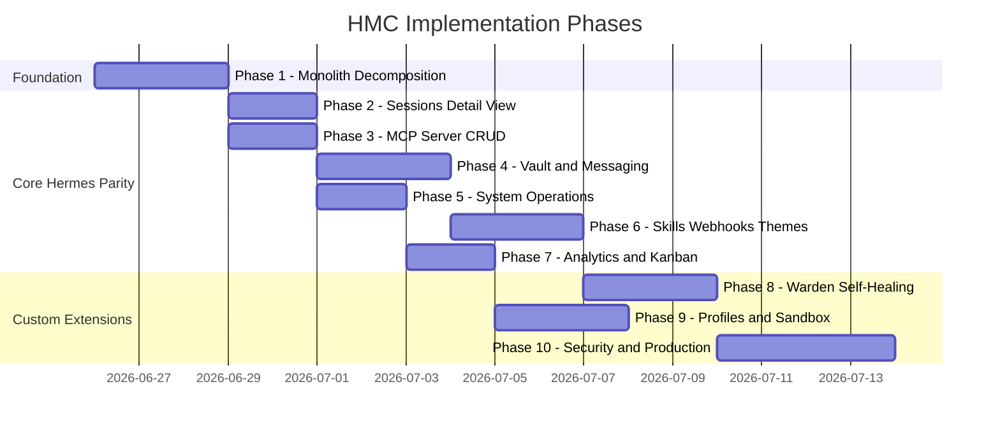

# Hermes Mission Control — Comprehensive Implementation Plan

> **Goal:** Transform the current HMC codebase into a production-grade, web-based Mission Control dashboard that provides **complete Hermes agent oversight, control, and custom extensions** — all accessible through a secured tunnel URL from anywhere.

---

## Executive Summary

After auditing the codebase against [claude_implementation_plan.md](file:///d:/GitRepo/hermes_agent/claude_implementation_plan.md), [project_gaps_hermes.md](file:///d:/GitRepo/hermes_agent/project_gaps_hermes.md), and the [documentation](file:///d:/GitRepo/hermes_agent/documentation) directory, the following critical findings emerged:

1. **The documentation claims many features are "COMPLETED" but the actual code tells a different story.** Many screens exist as UI shells in a monolithic 65KB [MiscScreens.tsx](file:///d:/GitRepo/hermes_agent/frontend/src/features/misc/MiscScreens.tsx) file, but their backend endpoints are stubs, return empty arrays, or use hardcoded mock data.
2. **The `claude_implementation_plan.md` describes fictional Hermes concepts** (company_loop.sh, litellm_hook.py, soul.md/taste.md, Layer 1/2/3 hierarchy) that don't exist in the real Hermes Agent. The `project_gaps_hermes.md` correctly identifies these — but the codebase still has remnants built on these fictional assumptions (e.g., `control_adapter.py` writes to a `~/.hermes/control/inbox/` directory that Hermes never reads).
3. **Critical real Hermes features are partially or fully missing** from the dashboard: proper embedded PTY chat, real session detail views, MCP CRUD that actually works, messaging channel setup, credential pool rotation, system operations with live output, analytics from real `model_usage` data.

> [!CAUTION]
> The documentation says "Sprint 10 Complete" and "All phases done" but the codebase has **24 backend route files where most are shallow shells**, a **65KB monolith frontend component**, **no real test coverage**, and several adapters that silently return empty arrays. This plan addresses every gap honestly.

---

## User Review Required

> [!IMPORTANT]
> **Decision 1 — Custom Extensions vs. Stock Hermes:** The `claude_implementation_plan.md` proposes custom concepts (Warden self-healing, soul.md/taste.md, Layer hierarchy). The `project_gaps_hermes.md` confirms these don't exist in Hermes. Do you want to:
> - **(A)** Build them as custom HMC-only extensions (more work, more power)
> - **(B)** Drop them and achieve 1:1 parity with stock Hermes dashboard features first, then add custom extensions later
> - **(C)** Build stock Hermes parity FIRST (Phases 1–6 below), then layer custom extensions (Phases 7–10)
>
> **This plan assumes option (C)** — stock parity first, custom extensions after.

> [!IMPORTANT]
> **Decision 2 — Control Plane Mechanism:** The `control_adapter.py` currently writes JSON intent files to `~/.hermes/control/inbox/` — but Hermes has no consumer for this directory. The real Hermes control path is through its CLI (`hermes` commands) or the PTY terminal. Do you want to:
> - **(A)** Use the embedded PTY as the primary control channel (type commands directly)
> - **(B)** Build a custom file-based dropbox AND add a cron/watcher on the Hermes side to consume it
> - **(C)** Use `hermes` CLI subprocess calls from the backend for control actions
>
> **This plan assumes (A) for interactive control and (C) for programmatic actions.**

> [!WARNING]
> **Decision 3 — Database Strategy:** The `claude_implementation_plan.md` proposed PostgreSQL. The `project_gaps_hermes.md` correctly says Hermes uses SQLite for everything. The current codebase has a `hermes_monitor.db` SQLite for HMC's own data + reads Hermes's `hermes_state.db` and `kanban.db`. Should we:
> - **(A)** Stay 100% SQLite (recommended, aligns with Hermes, zero extra infrastructure)
> - **(B)** Add PostgreSQL later for HMC's own aggregated data only
>
> **This plan assumes (A).**

---

## Open Questions

1. What is the actual Hermes `hermes_state.db` schema on your Oracle server? The `state_adapter.py` queries tables (`sessions`, `messages`, `model_usage`, `memory_fts`) — are these confirmed to match your installed Hermes version?
2. Is the Hermes gateway managed via `pkill -f hermes-gateway` (Docker) or a systemd service? The docs say Docker, but confirm for the Oracle ARM deployment.
3. For the Cloudflare Tunnel: are you using a **named tunnel** (stable subdomain) or **quick tunnel** (`trycloudflare.com`)? The current `tunnel_service.py` only parses quick tunnel logs.
4. What Hermes profiles exist on your server? The `profiles_adapter` needs to know the exact directory structure under `~/.hermes/profiles/`.

---

## Gap Analysis Summary

### Category A: Backend Stubs That Need Real Implementation

| File | Current State | What's Needed |
|------|--------------|---------------|
| [agents.py](file:///d:/GitRepo/hermes_agent/backend/app/api/v1/agents.py) | Returns empty `[]` | Query `hermes_state.db` sessions + `kanban.db` tasks for active agents |
| [tunnels.py](file:///d:/GitRepo/hermes_agent/backend/app/api/v1/tunnels.py) | Only reads quick tunnel URL from log file | Full tunnel CRUD: create/stop/rotate named tunnels, health check, Access policy |
| [control.py](file:///d:/GitRepo/hermes_agent/backend/app/api/v1/control.py) | Writes to fictional `control/inbox/` dir | Route through Hermes CLI subprocess or PTY |
| [memory.py](file:///d:/GitRepo/hermes_agent/backend/app/api/v1/memory.py) | 306 bytes — likely a stub | Full FTS5 search against `hermes_state.db` + MEMORY.md read/write |
| [sessions.py](file:///d:/GitRepo/hermes_agent/backend/app/api/v1/sessions.py) | Minimal — no FTS, no message detail | Full session browsing with message expansion, tool call rendering, search |

### Category B: Frontend Monolith That Needs Decomposition

| Problem | Impact |
|---------|--------|
| [MiscScreens.tsx](file:///d:/GitRepo/hermes_agent/frontend/src/features/misc/MiscScreens.tsx) is **65,112 bytes** containing 14 screen components | Unmaintainable, no code splitting, difficult to debug individual screens |
| Many screens render hardcoded/mock arrays inside the component | No live data, gives false impression of working features |
| No typed API client layer per domain | Inconsistent API calls, no caching, no error boundaries |
| Single Zustand store ([dashboardStore.ts](file:///d:/GitRepo/hermes_agent/frontend/src/store/dashboardStore.ts)) for everything | No domain separation, store becomes unwieldy |

### Category C: Features Claimed "IMPLEMENTED" But Actually Broken/Incomplete

| Feature | Documentation Claim | Actual Code Reality |
|---------|-------------------|---------------------|
| **Analytics** | "✅ Completed" | [AnalyticsScreen.tsx](file:///d:/GitRepo/hermes_agent/frontend/src/features/dashboard/AnalyticsScreen.tsx) exists but needs verification that `model_usage` table query actually returns data and Recharts graphs render dynamically |
| **Pairing Management** | "✅ Completed" | Returns hardcoded dummy array (per Sprint 9 notes in current `implementation_plan.md`) |
| **Vault Config Sync** | "✅ Completed" | Writes to `.env` but fails to register key into `config.yaml` rotation array (per Sprint 9) |
| **Skill Toggle** | "✅ Completed" | API exists but doesn't mutate `manifest.json` on disk (per Sprint 9) |
| **Gateway Restart** | "✅ Completed" | Needs the `subprocess.Popen` call actually wired in after messaging setup |
| **Theme System** | "✅ Completed" | Frontend ThemesScreen exists but theme hot-swap from `~/.hermes/dashboard-themes/` is untested |
| **Plugin System** | "✅ Completed" | [PluginLoader.tsx](file:///d:/GitRepo/hermes_agent/frontend/src/features/misc/PluginLoader.tsx) is 882 bytes — likely a shell |
| **Warden Overseer** | Exists | Has key_probe.py + loop_detector.py + scheduler.py but healer.py actions are in "suggest" mode only — no actual auto-rotation or auto-restart logic |

### Category D: Missing Real Hermes Dashboard Features (from `project_gaps_hermes.md`)

| Feature | Priority | Description |
|---------|----------|-------------|
| **Embedded Chat/PTY** | ✅ DONE | PTY terminal works via `/api/pty` + xterm.js |
| **Sessions Detail with Chat Bubbles** | 🔴 HIGH | Need Discord-style message rendering with collapsible tool calls |
| **MCP Server CRUD** | 🔴 HIGH | Need real add/test/enable/disable wired to `config.yaml` `mcp_servers:` block |
| **Messaging Channels Setup** | 🔴 HIGH | Per-platform forms (Telegram, Discord, etc.) writing to `.env` + `config.yaml` |
| **Credential Pool Rotation** | 🔴 HIGH | Dynamic per-provider key pools, not fixed scheme |
| **System Operations** | 🟡 MEDIUM | Doctor, backup, audit with live log streaming |
| **Skills Hub Install** | 🟡 MEDIUM | Hub search + install with live output |
| **Webhook Management** | 🟡 MEDIUM | HMAC secret generation on route creation |
| **Shell Hooks** | 🟡 MEDIUM | Consent-gated hook management |
| **Checkpoints/Rollback** | 🟡 MEDIUM | View/prune rollback filesystem store |
| **Skill Curator** | 🟢 LOW | Pause/resume background skill maintenance |
| **Pairing Management** | 🟢 LOW | Approve/revoke messaging users |

---

## Proposed Changes

---

### Phase 1: Foundation Cleanup — Kill the Monolith & Fix the Architecture

> **Goal:** Make the codebase honest, maintainable, and ready for real feature work.

#### Frontend

##### [MODIFY] [MiscScreens.tsx](file:///d:/GitRepo/hermes_agent/frontend/src/features/misc/MiscScreens.tsx) → DECOMPOSE into individual screen files
- Extract each of the 14 screen components into their own files under `features/`:
  - `features/vault/VaultScreen.tsx`
  - `features/profiles/ProfilesScreen.tsx`
  - `features/sessions/SessionsScreen.tsx`
  - `features/memory/ObsidianScreen.tsx`
  - `features/chat/ChatScreen.tsx`
  - `features/tunnels/TunnelsScreen.tsx`
  - `features/settings/SettingsScreen.tsx`
  - `features/channels/ChannelsScreen.tsx`
  - `features/webhooks/WebhooksScreen.tsx`
  - `features/mcp/MCPScreen.tsx`
  - `features/plugins/PluginsScreen.tsx`
  - `features/skills/SkillsScreen.tsx`
  - `features/models/ModelsScreen.tsx`
  - `features/themes/ThemesScreen.tsx`
- Delete `MiscScreens.tsx` after extraction
- Update [routes.tsx](file:///d:/GitRepo/hermes_agent/frontend/src/routes.tsx) to import from new locations

##### [NEW] `lib/api/` — One typed API client per backend domain
- `sessions_api.ts` — GET /sessions, GET /sessions/:id/messages
- `mcp_api.ts` — GET/POST/PUT/DELETE /mcp
- `messaging_api.ts` — GET/POST messaging channels and pairing
- `profiles_api.ts` — GET/PUT /profiles
- `skills_api.ts` — GET /skills, POST /skills/install, POST /skills/:id/toggle
- `vault_api.ts` — (extend existing) add key rotation, reveal
- `ops_api.ts` — POST /ops/doctor, POST /ops/backup, POST /ops/audit
- `analytics_api.ts` — GET /analytics
- `tunnels_api.ts` — GET/POST/DELETE tunnels
- `checkpoints_api.ts` — GET/DELETE checkpoints
- `hooks_api.ts` — GET/POST/DELETE hooks
- `themes_api.ts` — GET/PUT themes
- `plugins_api.ts` — GET plugins

##### [NEW] `store/` — Domain-specific Zustand stores
- `sessionStore.ts`, `agentStore.ts`, `wardenStore.ts`, `mcpStore.ts`, `settingsStore.ts`
- Migrate away from the single `dashboardStore.ts` monolith

##### [MODIFY] [App.tsx](file:///d:/GitRepo/hermes_agent/frontend/src/App.tsx)
- Extract `LoginScreen` into `features/auth/LoginScreen.tsx`
- Extract `NavSection`, `NavItem`, `TopBar` into `components/layout/`
- Reduce App.tsx to pure layout + router shell (target: <100 lines)

#### Backend

##### [MODIFY] [agents.py](file:///d:/GitRepo/hermes_agent/backend/app/api/v1/agents.py)
- Replace empty `return []` with real query against `hermes_state.db` sessions table + `kanban.db` tasks to derive active agents from recent session data

##### [MODIFY] [memory.py](file:///d:/GitRepo/hermes_agent/backend/app/api/v1/memory.py)
- Add real FTS5 search endpoint using `HermesStateAdapter.search_memory()`
- Add MEMORY.md / USER.md read/write endpoints (filesystem operations)

##### [NEW] `backend/app/schemas/` — Pydantic request/response DTOs
- Create typed schemas for every API domain to replace raw `Dict[str, Any]` returns
- Add response models with secret redaction (mask `sk-...` patterns)

##### [MODIFY] [control_adapter.py](file:///d:/GitRepo/hermes_agent/backend/app/services/hermes/control_adapter.py)
- Replace fictional `control/inbox/` file dropbox with:
  - For programmatic control: `subprocess.run(["hermes", ...])` CLI invocation
  - For interactive control: route through existing PTY WebSocket
  - Keep the intent file approach as an optional fallback if user builds the consumer

---

### Phase 2: Sessions Detail View — The Chat Interface

> **Goal:** Build the #1 missing feature: a Discord-style session message viewer.

##### [MODIFY] `features/sessions/SessionsScreen.tsx` (from Phase 1 extraction)
- Left panel: scrollable session list with timestamps, preview text, model used
- Right panel: full message history with:
  - Color-coded role bubbles (user = right/blue, assistant = left/gray, system = center/muted)
  - **Collapsible tool call accordions**: `▶ 🛠️ Executed web_search` → expand to see JSON payload
  - Token count badges per message
  - FTS5 search bar at the top
- Pagination for large sessions (100+ messages)

##### [MODIFY] [state_adapter.py](file:///d:/GitRepo/hermes_agent/backend/app/services/hermes/state_adapter.py)
- Add `get_session_detail(session_id)` — returns session metadata + model + token totals
- Add `search_sessions(query)` — FTS5 search across session content
- Add `get_session_tool_calls(session_id)` — extract tool call events from messages
- Validate that `messages` table columns match actual Hermes schema (role, content, tool_calls, created_at)

##### [MODIFY] [sessions.py](file:///d:/GitRepo/hermes_agent/backend/app/api/v1/sessions.py)
- Add `GET /sessions/{session_id}` — full detail endpoint
- Add `GET /sessions/search?q=...` — FTS search endpoint
- Add `GET /sessions/{session_id}/tool-calls` — tool call extraction

---

### Phase 3: MCP Server Management — Real CRUD

> **Goal:** Full MCP server add/test/enable/disable wired to `config.yaml`.

##### [MODIFY] `features/mcp/MCPScreen.tsx` (from Phase 1 extraction)
- Table view of all configured MCP servers from `config.yaml` `mcp_servers:` block
- "Add Server" modal with fields: name, type (stdio/sse), command/URL, args, env vars
- Enable/Disable toggle per server
- "Test Connection" button that pings the server and reports status
- Optional: MCP catalog browser for one-click install of approved servers

##### [MODIFY] [mcp.py](file:///d:/GitRepo/hermes_agent/backend/app/api/v1/mcp.py)
- Verify the existing 3,722-byte implementation handles:
  - `GET /mcp` — list all configured servers from `config.yaml`
  - `POST /mcp` — add new server entry to `config.yaml` via `ruamel.yaml`
  - `PUT /mcp/{name}` — update server config
  - `DELETE /mcp/{name}` — remove server entry
  - `POST /mcp/{name}/test` — attempt connection to the server
  - `POST /mcp/{name}/toggle` — enable/disable

---

### Phase 4: Credential Vault & Messaging Channels

> **Goal:** Dynamic per-provider key pools + messaging channel setup forms.

#### Vault

##### [MODIFY] `features/vault/VaultScreen.tsx`
- Per-provider key pool sections (OpenRouter, Anthropic, OpenAI, etc.)
- Add key → encrypted at rest → registered in `config.yaml` rotation array
- Reveal key (owner only, audited)
- Key health badges (from Warden probe results)
- Per-key usage chart (RPM, tokens today, predicted exhaustion)

##### [MODIFY] [vault.py](file:///d:/GitRepo/hermes_agent/backend/app/api/v1/vault.py) (3,269 bytes)
- Fix the Sprint 9 gap: after writing to `.env`, also update `config.yaml` `llm.providers.<provider>.api_keys` array using `ruamel.yaml`
- Add `POST /vault/{key_id}/reveal` — requires re-auth, creates audit log entry
- Add `POST /vault/{key_id}/rotate` — disable old key, activate replacement

#### Messaging Channels

##### [MODIFY] `features/channels/ChannelsScreen.tsx`
- Per-platform setup forms for: Telegram, Discord, Slack, WhatsApp, Signal, Matrix, Email
- Each platform: bot token field, enable/disable toggle, "Test Connection", "Restart Gateway"
- Channel status indicators (connected/disconnected/error)

##### [MODIFY] [messaging.py](file:///d:/GitRepo/hermes_agent/backend/app/api/v1/messaging.py) (3,924 bytes)
- Verify existing implementation covers:
  - Platform-specific token writing to `.env` (e.g., `TELEGRAM_BOT_TOKEN=xxx`)
  - Config update in `config.yaml` messaging section
  - Gateway restart trigger (`pkill -f hermes-gateway` for Docker)
  - Test connection per platform
- Fix Sprint 9 gap: wire the `subprocess.Popen` restart call after setup

#### Pairing

##### [MODIFY] [messaging.py](file:///d:/GitRepo/hermes_agent/backend/app/api/v1/messaging.py) (pairing routes)
- Fix Sprint 9 gap: replace hardcoded dummy array with real SQLite query
- Define `PairingRequest` model if missing
- Wire `POST /pairing/{user_id}/approve` to actual DB update

---

### Phase 5: System Operations & Diagnostics

> **Goal:** Doctor check, backup/restore, security audit, all with live log streaming.

##### [MODIFY] `features/settings/SettingsScreen.tsx`
- Large action buttons for: **Run Doctor**, **Security Audit**, **Backup Database**, **Restore**
- Each action opens a modal with live-streaming terminal output via WebSocket
- Monaco editor for `config.yaml` and `.env` editing (verify `@monaco-editor/react` integration)

##### [MODIFY] [ops.py](file:///d:/GitRepo/hermes_agent/backend/app/api/v1/ops.py) (797 bytes — likely a stub)
- `POST /ops/doctor` — run `hermes doctor`, stream output via WebSocket `/ws/ops`
- `POST /ops/audit` — run `hermes audit`, stream output
- `POST /ops/backup` — run backup script, return download path
- `POST /ops/restore` — accept backup upload, restore
- `POST /ops/prompt-size` — prompt size breakdown

##### [NEW] WebSocket endpoint `/ws/ops` for live operation log streaming
- Server spawns subprocess, reads stdout line-by-line, pushes to WS
- Frontend renders in xterm.js or log console component

---

### Phase 6: Skills Hub, Webhooks, Shell Hooks, Checkpoints, Themes

> **Goal:** Complete remaining real Hermes dashboard features.

#### Skills

##### [MODIFY] `features/skills/SkillsScreen.tsx`
- Installed skills grid from `~/.hermes/skills/`
- Enable/disable toggle per skill (writes to `manifest.json`)
- "Install Skill" with hub search + live log streaming
- "Update All" button

##### [MODIFY] [skills.py](file:///d:/GitRepo/hermes_agent/backend/app/api/v1/skills.py) (3,289 bytes)
- Fix Sprint 9 gap: `POST /{skill_id}/toggle` must read `manifest.json`, flip `enabled`, write back
- Add `POST /skills/install` — run `hermes skills install <id>`, stream output
- Add `POST /skills/update-all` — run `hermes skills update`, stream output

#### Webhooks

##### [MODIFY] `features/webhooks/WebhooksScreen.tsx`
- Create/enable/disable webhook routes
- Display route URL + one-time HMAC secret on creation
- Event filter configuration (deploy, key-dead, agent-stuck, etc.)

##### [MODIFY] [hooks.py](file:///d:/GitRepo/hermes_agent/backend/app/api/v1/hooks.py) (1,634 bytes)
- Verify shell hooks CRUD reads/writes `~/.hermes/shell-hooks-allowlist.json`
- Add consent-gated security model

#### Checkpoints

##### [MODIFY] [checkpoints.py](file:///d:/GitRepo/hermes_agent/backend/app/api/v1/checkpoints.py) (1,660 bytes)
- Verify reading from `~/.hermes/rollback/` directory
- Add path traversal protection (per security hardening notes in project_tracking.md)
- Prune endpoint with confirmation

#### Themes

##### [MODIFY] `features/themes/ThemesScreen.tsx`
- Theme picker grid with preview swatches
- Built-in themes: Hermes Teal, Midnight, Ember, Mono, Cyberpunk, Rosé
- Custom theme support from `~/.hermes/dashboard-themes/` YAML files
- Hot-swap: apply theme without page reload via CSS variable injection

---

### Phase 7: Analytics & Kanban — Live Data from Real Sources

> **Goal:** Token usage charts and Kanban boards fed from actual Hermes data.

#### Analytics

##### [MODIFY] [AnalyticsScreen.tsx](file:///d:/GitRepo/hermes_agent/frontend/src/features/dashboard/AnalyticsScreen.tsx)
- Stacked daily bar chart (Recharts) showing token usage by model
- Cost breakdown table (per-provider, per-model)
- Time range selector (7d, 30d, 90d)
- Ensure data comes from `model_usage` table, not mocks

##### [MODIFY] [analytics.py](file:///d:/GitRepo/hermes_agent/backend/app/api/v1/analytics.py) (1,583 bytes)
- Add daily aggregation query: `GROUP BY date(created_at)` on `model_usage`
- Add per-model breakdown query
- Add per-provider cost aggregation

#### Kanban

##### [MODIFY] [KanbanScreen.tsx](file:///d:/GitRepo/hermes_agent/frontend/src/features/kanban/KanbanScreen.tsx)
- Trello-style board with columns: Todo, In-Progress, Blocked, Done
- Cards show: task title, assigned agent, status badge, payload preview
- Data from `kanban.db` `tasks` + `workflows` tables via `KanbanAdapter`

##### [MODIFY] [kanban.py](file:///d:/GitRepo/hermes_agent/backend/app/api/v1/kanban.py) (441 bytes — likely a stub)
- Wire to `KanbanAdapter.get_workflows()` and `KanbanAdapter.get_tasks()`
- Add task status update endpoint

---

### Phase 8: Warden Self-Healing (Custom Extension)

> **Goal:** The custom self-healing overseer. This is NOT a stock Hermes feature — it's our custom extension.

> [!NOTE]
> This entire phase is custom build. Nothing in the real Hermes supports this out of the box. The current codebase has the skeleton ([key_probe.py](file:///d:/GitRepo/hermes_agent/backend/app/services/warden/key_probe.py), [loop_detector.py](file:///d:/GitRepo/hermes_agent/backend/app/services/warden/loop_detector.py), [healer.py](file:///d:/GitRepo/hermes_agent/backend/app/services/warden/healer.py), [scheduler.py](file:///d:/GitRepo/hermes_agent/backend/app/services/warden/scheduler.py)) but needs significant hardening.

##### [MODIFY] [key_probe.py](file:///d:/GitRepo/hermes_agent/backend/app/services/warden/key_probe.py)
- Extend provider support beyond OpenAI/Anthropic: add OpenRouter, Google, Groq
- Add RPM/TPM tracking per key
- Add predicted exhaustion calculation based on usage rate
- On probe failure: auto-update key status in vault, fire webhook alert

##### [MODIFY] [healer.py](file:///d:/GitRepo/hermes_agent/backend/app/services/warden/healer.py)
- Implement actual healing actions (currently only "suggest" mode):
  - `rotate_key()` — disable failed key, promote next in pool, update LiteLLM config
  - `restart_agent()` — kill stuck agent session, restart via Hermes CLI
  - `steer_agent()` — inject "you appear stuck, re-plan" via control path
  - `global_cooldown()` — pause all spawns when pool is saturated
- Implement autonomy levels: `observe-only` → `suggest` → `auto-heal-low-risk` → `full-auto`

##### [MODIFY] `features/warden/WardenScreen.tsx`
- Event timeline with severity badges (INFO/WARNING/CRITICAL)
- Key health dashboard with probe results per key
- Autonomy level selector (dropdown)
- Manual action buttons: "Rotate Key", "Restart Agent", "Trigger Probe"
- Approve/deny queue for suggested heals

---

### Phase 9: Agent Profiles & Sandbox (Custom Extensions)

> **Goal:** Agent identity management + code sandbox for watching coding agents.

#### Agent Profiles

##### [MODIFY] `features/profiles/ProfilesScreen.tsx`
- Card grid showing all profiles from `~/.hermes/profiles/`
- Click a profile → side drawer with:
  - System prompt / identity text
  - Equipped tools list
  - Model routing configuration
  - Memory banks for this profile
- Edit capabilities: modify system prompt, toggle tools, save back to filesystem

##### [MODIFY] [profiles.py](file:///d:/GitRepo/hermes_agent/backend/app/api/v1/profiles.py) (1,058 bytes)
- Scan `~/.hermes/profiles/` directory for profile folders
- Read each profile's `config.yaml`, memories, skills
- Write profile changes back to disk (atomic writes with backup)

#### Code Sandbox

> [!NOTE]
> The sandbox is the most complex custom feature. It requires Docker container access for PTY streaming and file watching. Phase this carefully.

##### [MODIFY] `features/sandbox/SandboxScreen.tsx`
- Three-panel layout:
  - **Left:** File tree of agent's working directory
  - **Center:** Monaco editor with syntax highlighting (read files, view diffs)
  - **Right/Bottom:** xterm.js terminal connected to agent's container shell
- Live activity overlay: highlight currently-edited file
- Git diff view: what changed this session

##### [MODIFY] [sandbox_service.py](file:///d:/GitRepo/hermes_agent/backend/app/services/hermes/sandbox_service.py) (2,617 bytes)
- Verify file listing works against real Hermes working directories
- Add git diff computation (`subprocess` → `git diff`)
- Add file watcher → push "file changed" events via WebSocket
- Container PTY bridge (if Docker backend): spawn shell in container, stream via WS

##### [MODIFY] [sandbox.py](file:///d:/GitRepo/hermes_agent/backend/app/api/v1/sandbox.py) (1,424 bytes)
- Add `GET /sandbox/diff` — git diff for current session
- Add WebSocket endpoint `/ws/sandbox/terminal` for container PTY
- Add `GET /sandbox/activity` — SSE stream of file change events

---

### Phase 10: Security Hardening, Tunnel Control & Production Readiness

> **Goal:** Make it safe to expose via tunnel. Harden auth, add RBAC, encrypt secrets.

#### Authentication & RBAC

##### [MODIFY] [security.py](file:///d:/GitRepo/hermes_agent/backend/app/core/security.py) (903 bytes)
- Verify JWT + refresh token flow works correctly
- Add TOTP 2FA enrollment + verification endpoints
- Password hashing with Argon2/bcrypt (verify current implementation)

##### [MODIFY] [rbac.py](file:///d:/GitRepo/hermes_agent/backend/app/core/rbac.py) (533 bytes)
- Implement role hierarchy: `owner` > `operator` > `viewer`
- Gate control endpoints (inject/steer/pause) to `operator+`
- Gate secret reveal and sandbox terminal to `owner` only
- Gate all write operations by role

##### [MODIFY] [vault.py](file:///d:/GitRepo/hermes_agent/backend/app/core/vault.py) (854 bytes)
- Verify Fernet/AES-GCM encryption at rest for stored API keys
- Master key from environment variable (never in DB)
- Add centralized redaction filter: scrub `sk-...`, `xai-...`, etc. from all API responses + WebSocket frames

##### [NEW] `backend/app/models/audit.py`
- Append-only audit log table: actor, action, target, IP, result, timestamp
- Log every: login, secret reveal, control action, config change

#### Tunnel & Remote Access

##### [MODIFY] [tunnel_service.py](file:///d:/GitRepo/hermes_agent/backend/app/services/hermes/tunnel_service.py) (1,510 bytes)
- Support named Cloudflare Tunnels (not just quick tunnels)
- Tunnel CRUD: create, stop, rotate URL, restart
- Health check loop: auto-restart dropped tunnel
- Store tunnel token in encrypted vault

##### [MODIFY] `features/tunnels/TunnelsScreen.tsx`
- Tunnel status card: name, public URL, health, uptime
- Action buttons: Create, Stop, Rotate URL, Copy Link
- Cloudflare Access policy status indicator

#### WebSocket Hardening

##### [MODIFY] WebSocket endpoint in [main.py](file:///d:/GitRepo/hermes_agent/backend/app/main.py)
- Already has JWT validation on WS connect ✅
- Add room/topic model: viewers can't subscribe to secret channels
- Add heartbeat + reconnect with replay-from-cursor
- Add server-side log sampling for error storms (backpressure)

#### CORS & Headers

##### [MODIFY] [main.py](file:///d:/GitRepo/hermes_agent/backend/app/main.py) CORS settings
- Replace `allow_origins=["http://localhost:5173", "http://localhost:3000"]` with dynamic config from settings
- Add security headers middleware: HSTS, CSP, X-Frame-Options, X-Content-Type-Options
- HTTPS-only cookies for refresh tokens

#### Plugin System

##### [MODIFY] [PluginLoader.tsx](file:///d:/GitRepo/hermes_agent/frontend/src/features/misc/PluginLoader.tsx) (882 bytes)
- Implement `window.__HERMES_PLUGIN_SDK__` exposure
- Scan `~/.hermes/plugins/` for `manifest.json` + JS bundles
- Load plugin bundles dynamically without rebuilding React
- Plugin slot injection: sidebar, header, new tabs

---

## Testing & Verification Plan

### Automated Tests

#### Backend (pytest)
```bash
# Test auth flow
pytest tests/test_auth.py -v

# Test state adapter against real hermes_state.db schema
pytest tests/test_state_adapter.py -v

# Test vault encryption/decryption
pytest tests/test_vault.py -v

# Test Warden key probe (mock HTTP responses)
pytest tests/test_warden_probe.py -v

# Test config adapter YAML read/write
pytest tests/test_config_adapter.py -v

# Test redaction filter
pytest tests/test_redaction.py -v
```

#### Frontend (Vitest)
```bash
# Component rendering tests
npx vitest run

# API client type safety
npx tsc --noEmit
```

### Manual Verification Checklist
- [ ] Login with real credentials → JWT issued → protected routes accessible
- [ ] Dashboard shows live host metrics from WebSocket
- [ ] Sessions screen shows real sessions from `hermes_state.db`
- [ ] Session detail shows chat bubbles with collapsible tool calls
- [ ] MCP screen lists servers from `config.yaml` → can add/test/toggle
- [ ] Vault adds a key → `.env` updated → `config.yaml` rotation array updated
- [ ] Skills toggle flips `manifest.json` `enabled` field on disk
- [ ] Messaging channel setup writes tokens to `.env` and restarts gateway
- [ ] Analytics charts render with real data from `model_usage` table
- [ ] Kanban board shows tasks from `kanban.db`
- [ ] PTY terminal works via tunnel (not just localhost)
- [ ] Warden probe detects a dead key → creates event → shows in UI
- [ ] Tunnel URL is accessible from external browser

### Integration Test
```bash
# Full end-to-end: start backend, verify all endpoints respond
python -m pytest tests/ -v --tb=short

# Build and verify frontend
cd frontend && npm run build && cd ..

# Start unified server and test tunnel
uvicorn app.main:app --host 0.0.0.0 --port 8000
```

---

## Implementation Priority & Dependencies



---

## Summary of Key Architectural Decisions

| Decision | Choice | Rationale |
|----------|--------|-----------|
| **Database** | SQLite only | Matches Hermes native stack, zero extra infrastructure |
| **Frontend state** | Zustand + TanStack Query | Lightweight, domain-sliced stores + server state caching |
| **Control plane** | PTY (interactive) + CLI subprocess (programmatic) | Works with stock Hermes, no fictional consumers needed |
| **Secret storage** | Fernet/AES-GCM encrypted in SQLite | Master key from env, never in DB |
| **Tunnel** | Named Cloudflare Tunnel + Access | Stable URL, dual-gate security |
| **Warden** | Custom extension, suggest mode default | Zero-cost local execution, user approves heals initially |
| **Config editing** | `ruamel.yaml` with `.setdefault()` | Preserves YAML comments and formatting |
| **Frontend decomposition** | One file per screen feature | Kill 65KB monolith, enable code splitting |
